# area54 — Technical Documentation

A complete technical reference for **area54**: a virtual software‑development
team, packaged as a Claude Code plugin, that runs a feature from a one‑line
roadmap entry through grooming, design, build, review and merge — pausing for a
human only at two decision gates.

This document explains **what the system is, how the pieces fit, and why each
guard exists.** It is written to be read on its own; the diagrams render on
GitHub.

- [1. Mental model](#1-mental-model)
- [2. System architecture](#2-system-architecture)
- [3. Distribution: plugin and marketplace](#3-distribution-plugin-and-marketplace)
- [4. The agents](#4-the-agents)
- [5. The commands](#5-the-commands)
- [6. The pipeline and the two gates](#6-the-pipeline-and-the-two-gates)
- [7. The merge gate](#7-the-merge-gate)
- [8. The shell guard](#8-the-shell-guard)
- [9. The orchestrator](#9-the-orchestrator)
- [10. Deployment into a target repo](#10-deployment-into-a-target-repo)
- [11. Telemetry](#11-telemetry)
- [12. Validation and CI](#12-validation-and-ci)
- [13. The eval harness](#13-the-eval-harness)
- [14. Repository layout](#14-repository-layout)
- [15. Architecture and code‑health review](#15-architecture-and-code-health-review)
- [16. Extending the team](#16-extending-the-team)

---

## 1. Mental model

area54 is **a team, not a framework**. The deliverable is a set of eight agent
prompts, seven slash commands, two shell hooks, and the small body of Python
that packages, validates, installs, and drives them. There is no server, no
database, and nothing to host — everything executes inside Claude Code on a
developer's machine or in CI.

One human role sits above the team: the **operator**, called the **CPO** (Chief
Product Officer) throughout the code and prompts. The operator owns the roadmap
and makes exactly two decisions per feature. Everything between those two
decisions is autonomous.

Four ideas hold the whole design together. Every mechanism in this document is
an application of one of them.

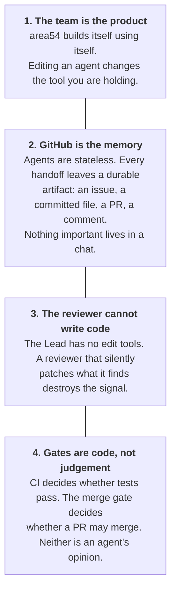

**Why "code, not judgement" matters.** A sufficiently persuasive prompt can talk
an agent into believing it is finished. It cannot talk a subprocess that queries
GitHub and exits non‑zero into passing. Wherever a decision is irreversible or
safety‑critical, area54 moves it out of the model and into a program that can be
tested, bisected, and reverted.

---

## 2. System architecture

The system has four planes: the **team** (prompts the model runs as), the
**guards** (hooks and gates that constrain what agents can do), the **tooling**
(Python that packages/validates/installs/drives), and the **artifacts** (durable
state on disk and in GitHub).

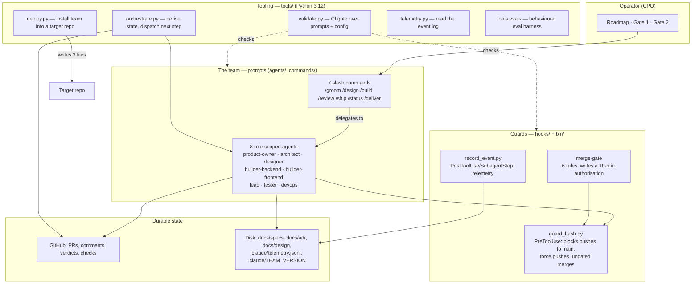

The four planes map onto four ideas from §1: the **team** carries the roles,
the **guards** enforce "code, not judgement," the **tooling** keeps the team
valid and moving, and the **artifacts** are the "GitHub is the memory" plane.

---

## 3. Distribution: plugin and marketplace

area54 **is** a Claude Code plugin. The repository root is the plugin, and it is
also its own single‑plugin marketplace.

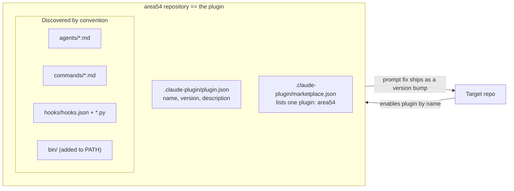

**Components are discovered by convention, not declared.** A top‑level `agents/`
directory loads all eight agents; a `commands/` directory loads all seven
commands; `hooks/hooks.json` configures the hooks; `bin/` is appended to `PATH`.
This is a measured property of the runtime, not the schema — see the docstring
of [`tools/plugin.py`](../tools/plugin.py), which records exactly which manifest
shapes validate but load nothing.

**Two things the plugin mechanism cannot carry**, and so are written as files by
the installer instead:

| What | Why not the plugin |
| --- | --- |
| The permission allow‑list (`.claude/settings.json`) | A plugin‑declared `deny` was **ignored at load time** on the measured CLI. Half the pipeline's autonomy lives in this list, so it travels as a real settings file. |
| The constitution (`.claude/TEAM.md`) | A plugin cannot ship project context. Until that is designed, the constitution is a file. |

Everything else — agents, commands, hooks, and the `merge-gate` binary — lives
in the plugin and reaches every target repo by version bump. `bin/` on `PATH` is
the key trick: an agent can type `merge-gate 8 --repo o/n` without knowing where
the plugin was checked out, because `${CLAUDE_PLUGIN_ROOT}` is not exported to
the Bash tool and an absolute path is wrong the moment the plugin moves.

---

## 4. The agents

Eight agents, each a Markdown file with YAML frontmatter, each with a fresh
context, its own tool allow‑list, and one job. All eight pin the exact model
identifier `claude-opus-5` — never a floating alias (see §12).

| Agent | Job | Reads | Writes | Tools |
| --- | --- | --- | --- | --- |
| `product-owner` | Roadmap item → buildable spec | `docs/roadmap.md` | `docs/specs/TF-NNN.md` | Read, Write, Glob, Grep, WebSearch, WebFetch |
| `architect` | Spec → technical decision (ADR) | the spec | `docs/adr/NNNN-*.md` | Read, Write, Edit, Glob, Grep, Bash, WebSearch, WebFetch |
| `designer` | Spec → interaction design | the spec | `docs/design/TF-NNN/` | Read, Write, Glob, Grep, Artifact |
| `builder-backend` | Server implementation + unit tests | spec + ADR + design | source + tests → draft PR | Read, Write, Edit, Glob, Grep, Bash, NotebookEdit |
| `builder-frontend` | Client implementation + unit tests | spec + ADR + design | source + tests → draft PR | Read, Write, Edit, Glob, Grep, Bash |
| `lead` | Reviews the diff; **cannot write code** | PR diff + constitution | PR review comments | Read, Grep, Glob, Bash |
| `tester` | Tests from the **spec**, not the code | the spec only | `tests/` only | Read, Write, Edit, Glob, Grep, Bash |
| `devops` | Pipeline, merge, release, rollback | CI config, release history | workflows, releases | Read, Write, Edit, Glob, Grep, Bash |

### Tool scoping is a load‑bearing separation

Each agent holds exactly the tools its role needs. Three separations are the
ones the design depends on, and they are **enforced mechanically** by
[`tools/agents.py`](../tools/agents.py) (`ROLE_POLICY`):

- **The Lead holds no `Edit`, `Write`, or `NotebookEdit`.** A reviewer that can
  edit stops reporting findings and starts silently patching them.
- **The Product Owner and Designer hold no `Bash`.** They define and design;
  they do not run code.
- **Every Builder holds `Bash`.** A builder that cannot run its own tests cannot
  meet the Definition of Done.

The honest limit: tool grants have no notion of file paths, so "the Tester
writes tests but never edits the implementation" **cannot** be enforced this way
— both need `Write` and `Edit`. That rule lives in the Tester's prompt, in the
Lead's review, and — behaviourally — in the eval suite (§13). The constitution
names it as the weakest link and tells readers to be suspicious of it.

### The handoff sequence

Each agent names its own successor, so the chain advances without a human
courier. This is encoded in `SEQUENCE` and checked at build time — an agent that
does not name who comes next is a build failure.

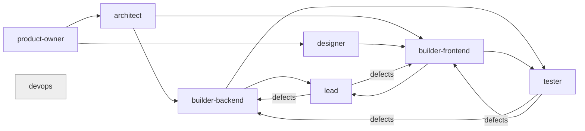

`devops` is terminal — it ships, and hands work to no one.

---

## 5. The commands

Seven slash commands. Six drive stages; `/deliver` runs the whole sequence.
Commands delegate to agents in one strict form — **`**agent-name** subagent`** —
so every delegation is checkable. A typo there is the worst available failure:
the command runs, delegates to nobody, and returns a plausible answer produced
by no one. [`tools/commands.py`](../tools/commands.py) resolves every reference
against a real agent before the team ships.

| Command | Delegates to | Purpose |
| --- | --- | --- |
| `/groom <item>` | `product-owner` | Roadmap item → spec → **Gate 1** |
| `/design TF-NNN` | `architect`, `designer` | ADR + design, in parallel |
| `/build TF-NNN` | `builder-backend`, `builder-frontend` | Code + unit tests → draft PR |
| `/review <PR>` | `lead`, `tester`, `builder-backend`, `builder-frontend` | Lead + Tester verdicts; the defect loop |
| `/ship <PR>` | `devops` | Merge (via the gate), tag, deploy |
| `/status` | — | What is in flight, what needs the operator |
| `/deliver <item>` | all seven | The whole sequence, stopping only at the two gates |

---

## 6. The pipeline and the two gates

`/deliver` runs the published sequence end to end. It stops in exactly two
places, and nowhere else.

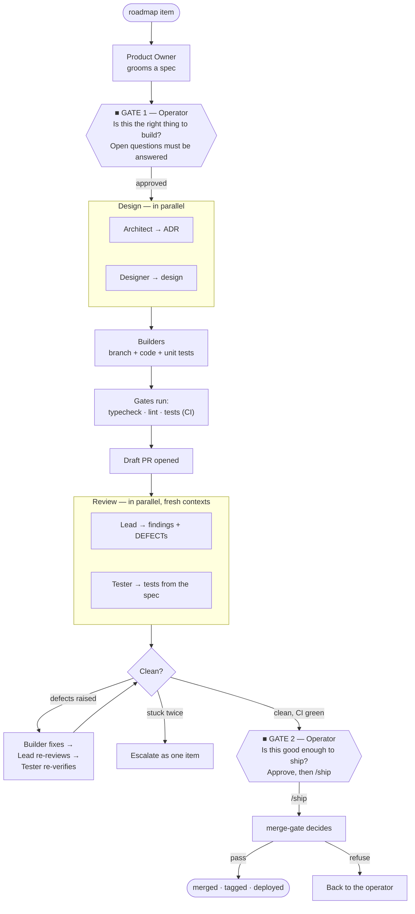

**Gate 1 — after the spec.** *Is this the right thing to build?* Open questions
are the gate: the team never answers them for the operator and never proceeds on
an assumption.

**Gate 2 — before merge.** *Is this good enough to ship?* The operator approves
and runs `/ship`; from there the **merge gate** (a program, §7) decides, and a
passing gate merges. Nobody waits for a second approval, and no agent merges
because it judged itself ready.

**Between the gates, the team does not ask.** Findings, defects, failing tests,
and contradictions between an ADR and a design are the team's own work. What
*does* interrupt is a closed list of six escalation conditions in the
constitution — and that list is the complete set. "Two consecutive defect rounds
with no progress" is one of the six, not the only one.

### The defect loop

The Tester **never fixes code.** When a test fails, it raises a defect and hands
it on. Fixing what you are checking destroys the separation and puts unreviewed
changes into the branch under the name of the person verifying it.

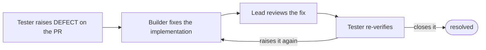

Only the Tester closes a defect it raised. The Lead reviews the fix but holds no
write tool, so it cannot close anything. A Builder that disagrees with a defect
says so on the defect and stops — it does not settle the argument by editing the
test.

---

## 7. The merge gate

The merge is the one irreversible step, so it is the one gate that is a program.
[`tools/merge_gate.py`](../tools/merge_gate.py) queries GitHub, applies six
rules, and exits non‑zero if any fails. On success it writes a short‑lived
authorisation; the shell guard (§8) permits `gh pr merge` **only** against a live
one. An agent cannot merge by concluding it is allowed to — only by having
actually passed.

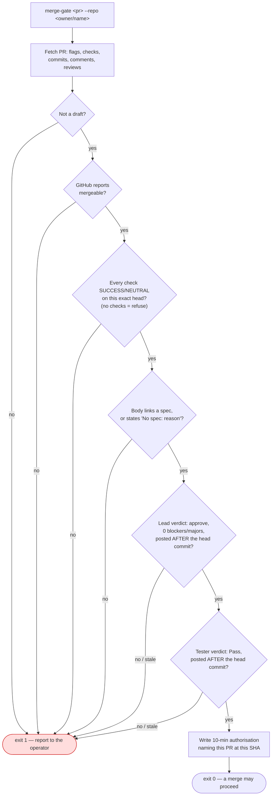

Three of these rules encode lessons that are worth spelling out:

- **"On this exact head."** A green CI run on an older commit proves nothing
  about the commit about to merge. The gate matches checks and verdicts to the
  head SHA.
- **"Posted after the head commit."** A verdict describes the code that existed
  when it was written. Approve, push more commits, wait for CI to go green,
  merge — and the verdicts now describe a commit that is no longer the head. The
  gate refuses that, and says so *differently* from "no verdict at all," because
  the fix is different: re‑review, not review. It catches the ordinary sequence,
  not every history rewrite (a force‑push preserving the committer date keeps a
  stale verdict looking current).
- **"No checks reported is a refusal, not a pass."** A repo with no CI would
  otherwise sail through the check meant to catch it.

### Authorisation lifecycle

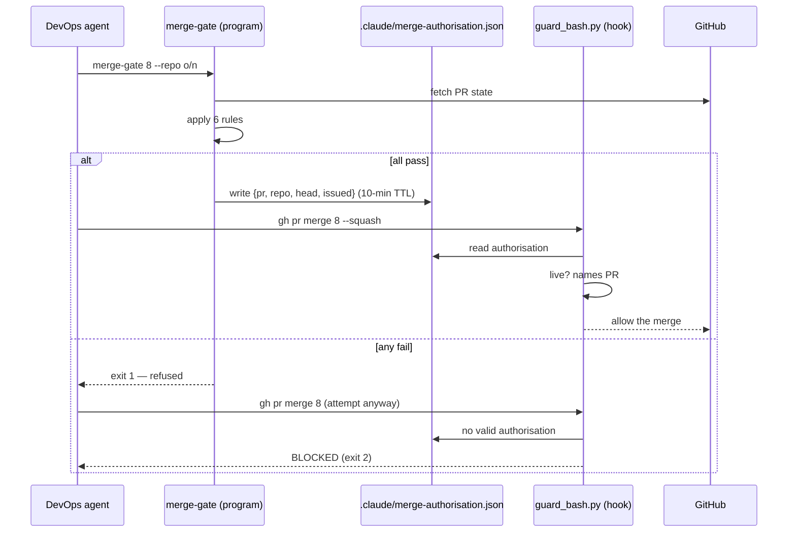

One gate pass authorises one merge, for ten minutes, for that PR at that commit.

---

## 8. The shell guard

A permission allow‑list matches command **prefixes**, which cannot express "push
anywhere except `main`": `git push -u origin main` matches an allow rule for
`git push -u origin` and misses a deny rule for `git push origin main`. That hole
was live in this repo's settings until a Lead review found it by reading.

[`hooks/guard_bash.py`](../hooks/guard_bash.py) is a `PreToolUse` hook on the
`Bash` tool that inspects the **actual command** instead of its prefix. Its core
insight, arrived at over three rounds of review, is to stop enumerating the shell
grammar and instead ask a single question: *is there a `git` or `gh` anywhere in
the text the shell will actually execute?*

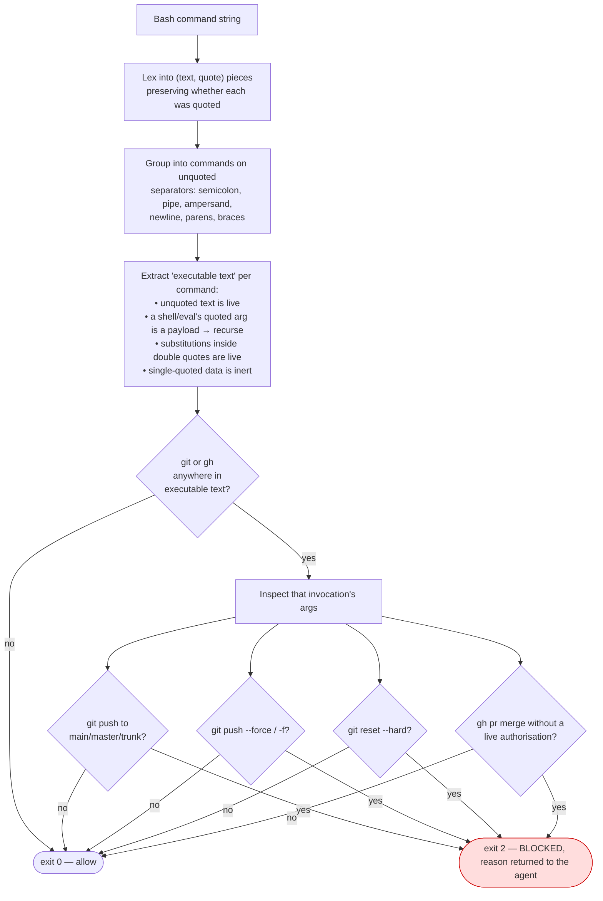

Design notes that matter:

- **It refuses to over‑refuse.** `echo "do not run git push origin main"` pushes
  nothing, so blocking it would be an accusation that is factually untrue — and
  it would stop an agent from documenting the very rule the guard enforces.
  Single‑quoted and merely‑mentioned commands are allowed; branch names that
  merely contain `main` (`feature/main`, `mainline`) are allowed.
- **It handles wrappers without enumerating them.** `bash -lc "…"`,
  `bash -c -- "…"`, `eval "…"`, `env -i git …`, `` `…` `` and `$(…)` inside
  double quotes are all resolved by recursion, capped at a depth deeper than any
  real quoting workaround.
- **It fails toward *allow* on its own error, and blocks only on a positive
  match.** A `PreToolUse` hook that raises is treated as non‑blocking, so the
  guard never raises: on an unparseable payload it returns 0. The global
  deny‑list in `.claude/settings.json` (`git push --force`, and the merge/push
  rules) is the backstop for the destructive cases.

The TTL constant `AUTHORISATION_TTL_SECONDS` is intentionally **duplicated** here
rather than imported from `merge_gate.py`: this hook runs inside target repos,
where the `tools/` package is not deployed. It must stand alone.

---

## 9. The orchestrator

The constitution *publishes* the pipeline and the command files *describe* each
step — but prose does not execute. In one day that produced six skipped steps:
`/review` never run on two PRs, a handoff announced and never sent, four PRs left
in draft after CI went green. [`tools/orchestrate.py`](../tools/orchestrate.py)
closes that gap.

**It stores no state.** Every drift bug came from state that could disagree with
reality, so the orchestrator *derives* state on every run from the roadmap, spec
Status lines, ADRs, branches, PR flags, verdicts, and checks. There is no state
file to fall out of step.

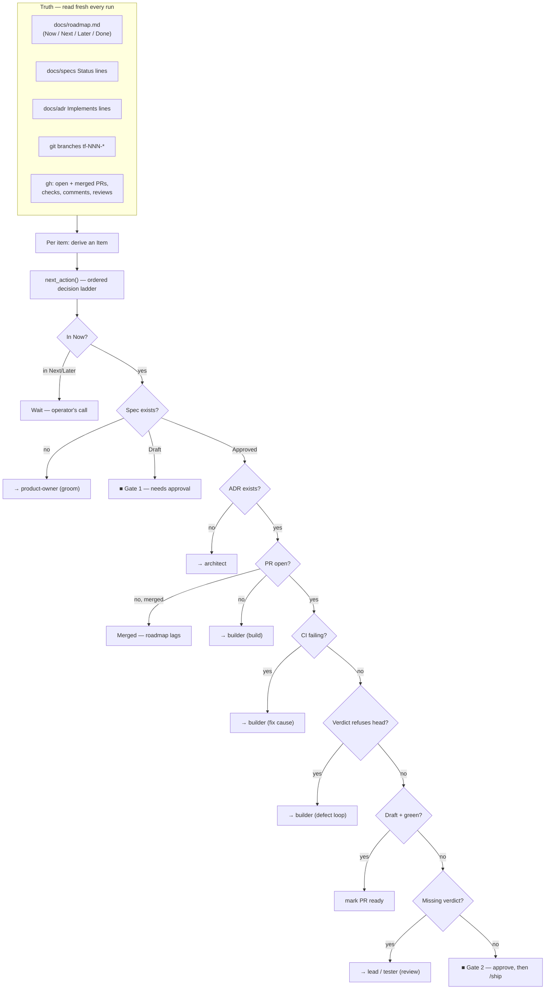

**`--run` dispatches exactly one action and stops.** Only two kinds are
dispatchable — an agent invocation, or `gh pr ready` — and `dispatch()` refuses
anything else as a *shape*, not a keyword to scan for. Nothing here can merge:
that belongs to the gate and the shell guard.

Two subtleties the code is careful about:

- **Ownership is read from the branch name only** (`tf-021-*`), never from a TF
  number mentioned in a title or body. A mention is not an implementation, and
  reading one once reported an item as "in review" on somebody else's PR.
- **Verdicts must postdate the head commit** — the same rule as the merge gate,
  reusing the same regexes (`LEAD_APPROVE`, `TESTER_VERDICT`, …) so the two never
  disagree about what a verdict is.

When an agent is dispatched, it is invoked with `--resume` on a **derived
session id** (a `uuid5` over `repo + item + role`) if that session already
exists — so a Lead reviewing the same PR for the sixth time rejoins the
conversation it has already had, rather than re‑reading the spec, ADR and diff
from cold. This is the "warm handoffs" mechanism (TF‑022).

---

## 10. Deployment into a target repo

Because the team travels as a plugin, deployment writes almost nothing.
[`tools/deploy.py`](../tools/deploy.py) writes **three files** and creates the
artefact directories:

```
python -m tools.deploy /path/to/repo            # install
python -m tools.deploy /path/to/repo --dry-run  # show the plan, change nothing
python -m tools.deploy /path/to/repo --check    # exit 1 if the repo is out of date
```

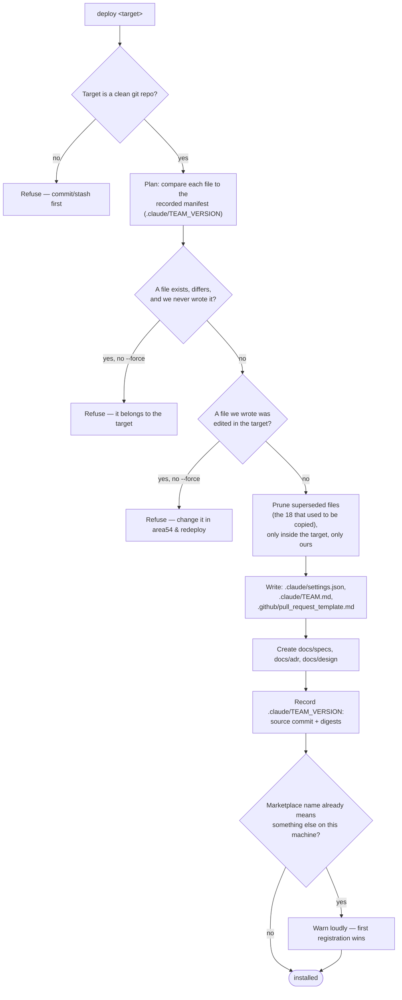

The design's throughline is **drift**: every written file records the source
commit it came from, local edits are reported rather than overwritten, and the
constitution opens by saying it is deployed and must be changed upstream. The
`superseded` logic also *migrates* already‑deployed repos off the eighteen files
the old copy‑based installer used to write — leaving a frozen `.claude/agents/`
behind would run a second, stale team alongside the plugin's.

---

## 11. Telemetry

"Why is it taking so long?" had no answer from data, only from commit
timestamps. [`hooks/record_event.py`](../hooks/record_event.py) is a
`PostToolUse`/`SubagentStop` hook that writes one JSON line per event to
`.claude/telemetry.jsonl`. [`tools/telemetry.py`](../tools/telemetry.py) reads it
back and reports stage durations and per‑agent counts, grouping events into runs
on long silences.

It is deliberately a **hook**, not something an agent calls: telemetry that
depends on the thing being measured remembering to report is telemetry you
cannot trust when it matters. And it **never blocks** — a failure in the recorder
must not stop the pipeline, so it always exits 0.

---

## 12. Validation and CI

area54 ships prompts, so the usual safety net of a type checker and a test suite
does not reach most of what can go wrong. [`tools/validate.py`](../tools/validate.py)
is the CI entry point that decides the part that *is* mechanically decidable. It
aggregates five validators:

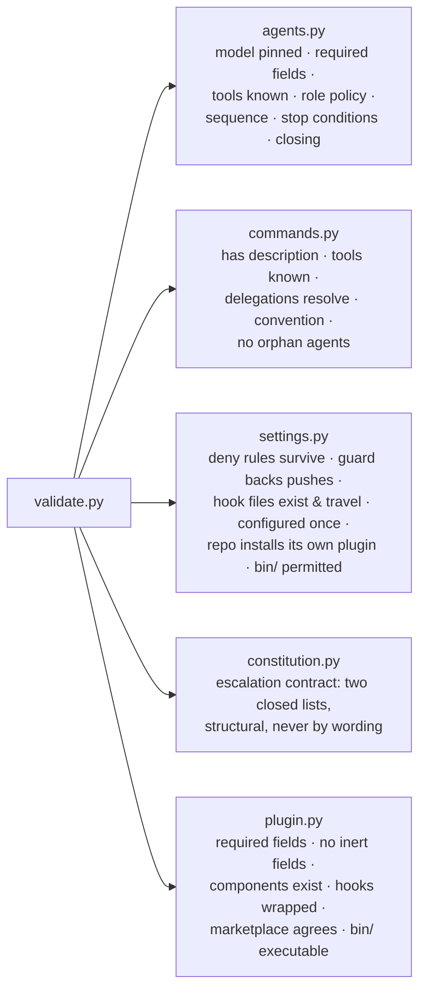

Two rules are worth calling out because they encode the project's sharpest
lessons:

- **Model pinning (TF‑002).** Every agent must pin an exact identifier
  (`claude-opus-5`), never a floating alias (`opus`, `sonnet`, `inherit`, …). An
  alias lets a model upgrade change every agent's behaviour with nothing in git
  to review, bisect, or revert. `PINNED_MODELS` is the allow‑list, and it lives
  here in area54, not in target repos.
- **Instructions must name a command that exists.** Everything under `agents/`,
  `commands/`, and `hooks/` is read as an instruction in a target repo, where
  there is no `tools/` package. Naming `python -m tools.merge_gate` there tells
  the agent to fail — so the check derives the full set of shipped instruction
  files and refuses any unscoped area54‑only spelling.

### CI

[`.github/workflows/ci.yml`](../.github/workflows/ci.yml) has two jobs:

| Job | Runs on | Checks |
| --- | --- | --- |
| **Governance** | pull requests | PR body links a spec (`docs/specs/TF-NNN`) or states `No spec: <reason>`; no secrets in the diff |
| **Typecheck / Lint / Test** | PRs and pushes to `main` | `mypy --strict`, `ruff check`, `pytest`, and `python tools/validate.py` |

CI is the only trustworthy quality signal. An agent saying "tests pass" means it
ran something; the CI run proves it.

### The self‑hosting loop

The reason all of this holds together is that **area54 is its own first
customer.**

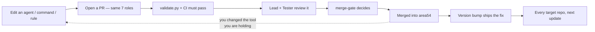

Changing an agent definition here changes the tool the team is currently using
to change it. That is the constraint that keeps the guards honest: a rule that
would make the team unusable makes *this* repo unusable first.

---

## 13. The eval harness

Some invariants are behavioural, not structural — "the Lead reports rather than
fixes," "the Tester refuses to weaken a failing test." These cannot be decided by
reading a file; they are scored over repeated live trials by the harness in
[`tools/evals/`](../tools/evals), against fixtures with **planted defects**.

```
python -m tools.evals          # run the suite (live; costs money)
python -m tools.evals --list    # list the cases without running them
```

Six cases live in [`evals/cases/`](../evals/cases), each pairing a role with a
fixture designed to tempt it into the failure the constitution forbids — a
Builder tempted to escalate a routine fix, a Lead tempted to patch an off‑by‑one
instead of reporting it, a Tester tempted to weaken a red test to make it green.
Errored trials (e.g. an expired CLI session) are reported as **inconclusive**,
never as behavioural failures. The harness shares one agent‑invocation path
(`cli_invocation`) with the orchestrator, so the team has exactly one way of
starting an agent.

---

## 14. Repository layout

```
area54/
├── .claude-plugin/
│   ├── plugin.json            # the plugin manifest (name, version, …)
│   └── marketplace.json       # this repo as its own single-plugin marketplace
├── agents/                    # 8 role prompts (discovered by convention)
├── commands/                  # 7 slash commands (discovered by convention)
├── hooks/
│   ├── hooks.json             # wraps the events (PreToolUse, PostToolUse, SubagentStop)
│   ├── guard_bash.py          # the shell guard
│   └── record_event.py        # the telemetry recorder
├── bin/
│   └── merge-gate             # puts the merge gate on PATH in every target repo
├── team/
│   └── TEAM.md                # the portable constitution (deployed to targets)
├── tools/                     # Python 3.12 supporting tools
│   ├── validate.py            # CI entry point
│   ├── agents.py commands.py constitution.py settings.py plugin.py
│   ├── deploy.py merge_gate.py orchestrate.py telemetry.py
│   └── evals/                 # the behavioural eval harness
├── tests/                     # pytest — deterministic checks over the above
├── evals/                     # eval cases + fixtures with planted defects
├── docs/
│   ├── roadmap.md             # the only input to everything
│   ├── adr/  specs/  design/  # where the team's artefacts land
│   └── ARCHITECTURE.md        # this document
├── CLAUDE.md                  # area54's own constitution (project context)
└── README.md
```

**Two constitutions, on purpose.** `CLAUDE.md` is area54's *own* project context
and stays in this repo. `team/TEAM.md` is the *portable* half — Definition of
Done, coding standards, git and handoff conventions, the defect loop, escalation,
tool scoping, and the list of things agents must never do — and it is the file
the installer deploys to every target repo. Change a portable rule in `TEAM.md`,
not in `CLAUDE.md`.

---

## 15. Architecture and code‑health review

This section records a deliberate review of the codebase for bloat, redundancy,
and dead weight — the first of the three tasks this documentation set was
produced for. The short version: **the codebase is already lean, and the parts
that look heavy are deliberate.**

### What the review checked, and found

| Check | Result |
| --- | --- |
| Dead code (unused functions/classes) | **None.** Every symbol is reachable — each is wired into a same‑file `validate()` aggregator, a `main()`, or the public API a test exercises. |
| Commented‑out code blocks | **None.** |
| `TODO` / `FIXME` / `HACK` markers | **None.** |
| Orphan agents (reachable by no command) | **None** — a validator (`check_no_orphan_agents`) fails the build on one. |
| Cross‑module duplication | **Three instances, all deliberate** (below). |

### The three duplications are intentional, not accidental

1. **The `git`/`gh` subprocess helper (`_gh`)** appears in both `merge_gate.py`
   and `orchestrate.py`. They raise *different* exception types (`GateError` vs
   `OrchestratorError`) that are part of each module's contract, and the two
   modules are kept deliberately independent. Extracting a shared helper would
   couple them for ~10 saved lines.
2. **The authorisation TTL constant** is defined in both `merge_gate.py` and
   `hooks/guard_bash.py`. This is *required*: the hook runs inside target repos
   where the `tools/` package does not exist, so it cannot import the constant.
   The duplication is documented in a comment at both sites.
3. **The manifest loaders** (`plugin_manifest`/`marketplace_manifest` in
   `deploy.py` vs `load_plugin`/`load_marketplace` in `plugin.py`) read the same
   files, but again raise distinct error types (`DeployError` vs `PluginError`)
   that mean different things to a caller — a *deployment* failure versus a
   *packaging* failure. Merging them would erase a meaningful distinction.

None of these is worth removing; each removal would make the design slightly
worse.

### The one real "heaviness" signal — and why it is a design choice

The supporting tooling and tests are far larger than the prompts they guard:

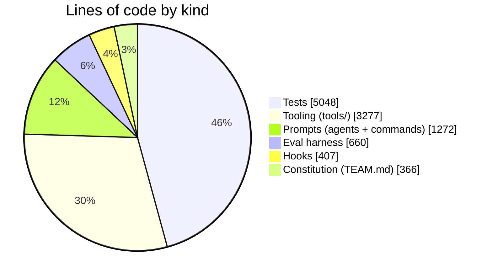

Roughly four lines of tooling and tests exist for every line of prompt. That
inversion is real, and it is **the deliberate consequence of "code, not
judgement" and "CI decides."** The prompts are the small, changeable surface;
the tooling is the harness that keeps them honest across every target repo. It
is already tracked as a roadmap item (TF‑017) rather than treated as accidental
bloat.

**The verbose, historical comments are a feature, not clutter.** Nearly every
guard carries a comment explaining the specific defect that motivated it — the
prefix‑matching push hole, the transcript‑only verdict, the stale‑verdict merge.
These are the project's institutional memory, and the constitution's own coding
standard mandates documenting non‑obvious logic. Stripping them to reduce line
count would delete the reasoning that keeps the next editor from reintroducing
the bug. The review's recommendation is explicitly **to keep them.**

### Conclusion

No code was removed, because removing any of it would either delete a tested
guard against a real defect, erase a deliberate separation, or throw away
documented rationale. A codebase that is honest about *why* each line exists is
the opposite of bloated — and this one is unusually honest.

---

## 16. Extending the team

- **Add or change an agent:** edit the Markdown in `agents/`. Keep the exact
  model pin, declare its place in the sequence (`## Where you sit in the
  sequence`), state its stop conditions, and close with a `Your final message:`
  line — all four are checked by `tools/agents.py`. Wire it into at least one
  command, or the orphan check fails the build.
- **Add a slash command:** add a Markdown file to `commands/` with a
  `description` frontmatter, and delegate to agents only in the
  `**agent-name** subagent` form.
- **Add a guard or a tool:** put executables in `bin/` (they go on `PATH` in
  every target repo) and add an allow rule so a headless run can call them. If a
  hook writes a file into the target, register a reader for it in
  `DEPLOYED_PATH_READERS` — a validator enforces that half‑features do not ship.
- **Change a portable rule:** edit `team/TEAM.md`, never a copy in a target
  repo. The next deployment overwrites local edits by design.
- **Before every change:** `python tools/validate.py` and `pytest` are the
  fast local gates; CI is the authority.

Every one of these paths is the same path the team uses on itself. There is no
privileged way to change area54 — you change it the way it changes everything
else.
